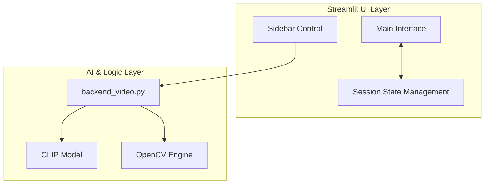

# 📐 개발설계도 (Design Document)

## 1. 개요 (Overview)
**Video Tagger AI**는 Vision-Language Model(CLIP)을 활용하여 영상을 시맨틱하게 검색하고 태깅할 수 있는 지능형 영상 관리 시스템입니다.

## 2. 시스템 아키텍처 (System Architecture)
본 시스템은 **Streamlit** 기반의 프론트엔드와 **OpenCV/Torch** 기반의 백엔드로 구성된 2레이어 아키텍처를 따릅니다.

## 3. 레이어별 설계 내역 (Layer Design)

### 3.1. 프론트엔드 레이어 (Frontend Layer)
- **UI Framework**: Streamlit (v1.x)
- **Design Theme**: 아쿠아 네온(Aqua Neon) 커스텀 테마
  - 배경색: `#050a0f` (심해색)
  - 포인트 컬러: `#00f2ff` (아쿠아), `#00ffcc` (에메랄드)
- **State Management**: `st.session_state`를 통한 전역 상태(Tags, Frame Index, Search Results) 관리

### 3.2. 백엔드 레이어 (Backend Layer)
- **Core Engine**: `backend_video.py`
- **Vision AI**: SentenceTransformer (CLIP-ViT-B-32)
- **Frame Processing**: OpenCV (BGR to RGB conversion & Sequential Seeking)
- **Similarity Search**: Cosine Similarity 기반 벡터 검색

## 4. 데이터 설계 (Data Design)
- **Frame Index**: `list[dict]` 형태 (Timestamp, Embedding Tensor)
- **Tag Data**: `list[dict]` (Timestamp, Label, Category, Note)
- **Storage**: CSV 파일 포맷 (`utf-8-sig` 인코딩 기반 Excel 호환)

## 5. 핵심 컴포넌트 설계 (Component Design)
- **Model Loader**: 싱글톤 패턴(Singleton)을 적용하여 메모리 낭비 방지 및 로딩 속도 최적화
- **Frame Extractor**: 성능과 안정성을 위해 Sequential Seek(순차 건너뛰기) 로직 적용
- **Tag Controller**: 검색 결과에서 즉시 태깅 및 탭 자동 전환(Navigation) 로직 포함
