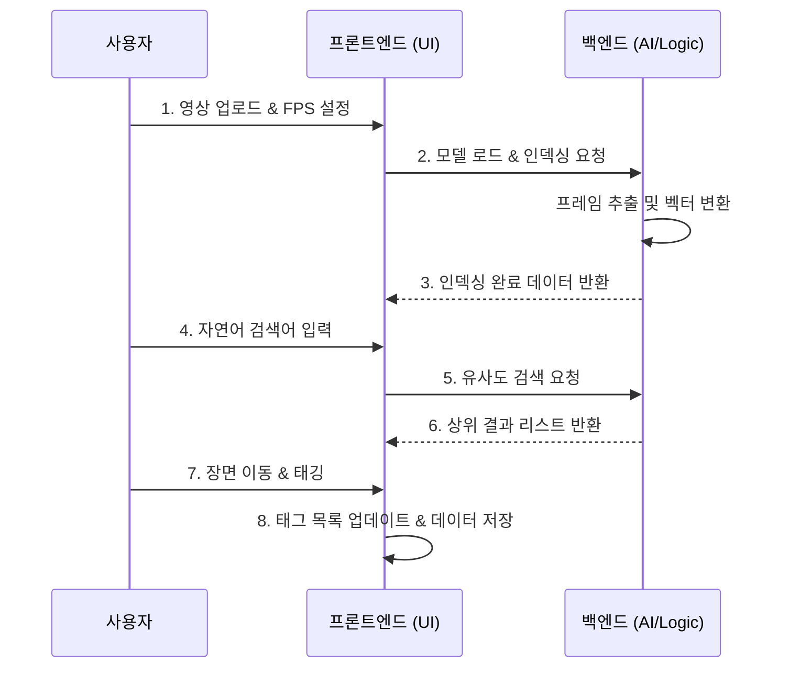

# ⚙️ 공정도 (Process Flow)

## 1. 사용자 워크플로우 (User Workflow)

## 2. 데이터 흐름도 (Data Flow)

### 2.1. 인덱싱 흐름 (Indexing Flow)
1. **Input**: Raw Video File
2. **Process**: 
   - Decoded Frames (CV2)
   - Image Normalization (PIL)
   - Feature Extraction (CLIP)
3. **Output**: Latent Space Vectors (Embedding)

### 2.2. 검색 흐름 (Search Flow)
1. **Query**: "A person in red glasses" (Text or Image)
2. **Encoding**: Query $\rightarrow$ Embedding Vector
3. **Comparison**: Vector Similarity Calculation (Dot Product)
4. **Ranking**: Sort by Score $\rightarrow$ Timestamp mapping
5. **UI Update**: Result Card Display with "Jump to Scene"

## 3. 탭 내비게이션 자동화 흐름 (Tab Automation)
- **Trigger**: AI 검색 결과의 `👉 장면 이동` 버튼 클릭
- **Action**:
  1. `st.session_state.start_time` 업데이트
  2. `st.session_state.active_tab`을 '수동 태깅'으로 설정
  3. `st.rerun()` 호출을 통해 즉시 탭 이동 및 비디오 시간 동기화
